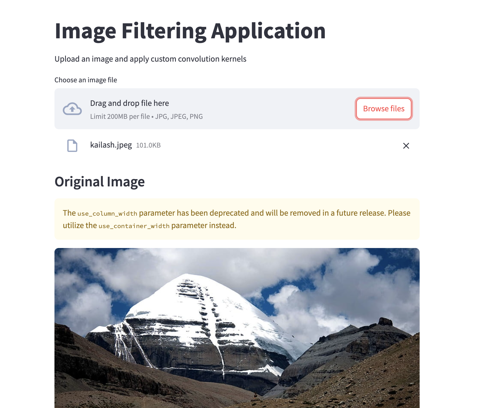
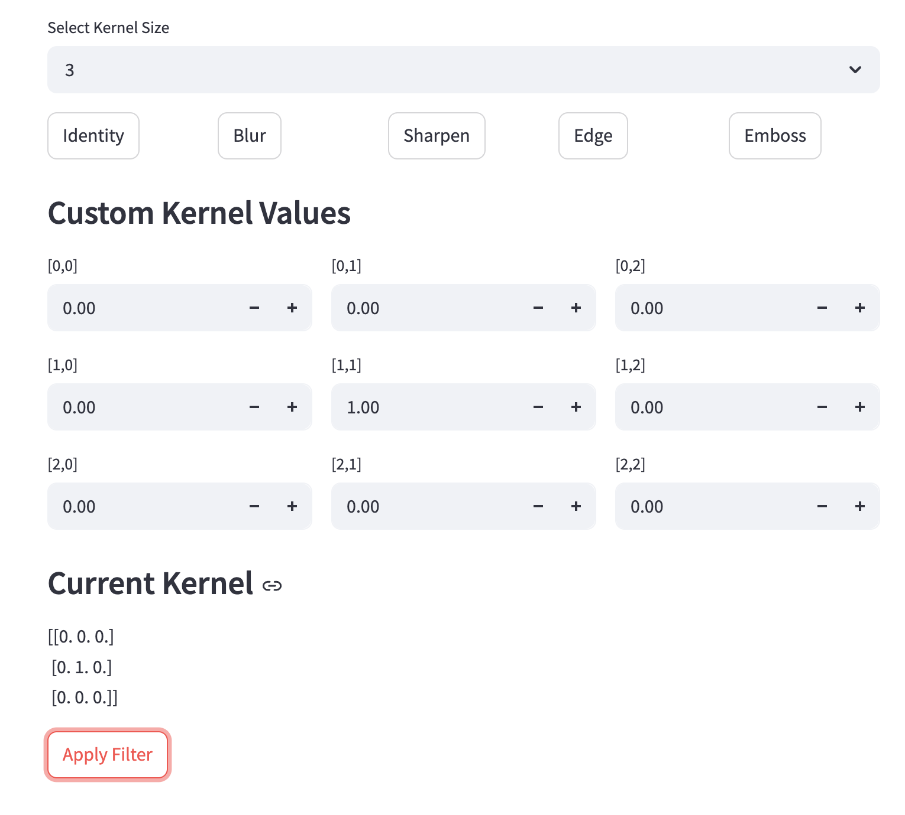

# Image Filtering Application

An interactive web application that allows users to experiment with image filtering using custom convolution kernels.





## Features

- **Image Upload**: Upload your own images to apply filters
- **Kernel Size Selection**: Choose between 3×3, 5×5, and 7×7 kernel sizes
- **Preset Filters**: Quick access to common image filters:
  - **Identity**: Preserves the original image (1 in center, 0 elsewhere)
  - **Blur**: Averages pixel values for a smooth effect
  - **Sharpen**: Enhances edges while maintaining detail
  - **Edge Detection**: Highlights edges in the image
  - **Emboss**: Creates a 3D embossed effect
- **Custom Kernel Values**: Manually input each value in the kernel matrix
- **Real-time Preview**: See the filtered image immediately after applying
- **Download Option**: Save the filtered image to your device

## How It Works

Convolution is a mathematical operation used in image processing where each pixel in an image is combined with its neighboring pixels, weighted by a kernel matrix, to produce a new pixel value. This application allows you to experiment with different kernel matrices to see how they affect the image.

## Local Setup

### Prerequisites
- Python 3.7 or higher
- pip (Python package installer)

### Installation

1. Clone this repository:
   ```
   git clone 
   cd 
   ```

2. Install the required packages:
   ```
   pip install -r requirements.txt
   ```

3. Run the application:
   ```
   streamlit run app.py
   ```

4. Open your browser and navigate to:
   ```
   http://localhost:8501
   ```

## Requirements

```
streamlit>=1.20.0
numpy>=1.20.0
Pillow>=8.0.0
opencv-python>=4.5.0
```

## Usage Guide

1. **Upload an Image**: Click "Browse files" to select an image from your device
2. **Select Kernel Size**: Choose the dimensions of your convolution kernel
3. **Choose a Preset Filter**: Click on one of the preset buttons or create your own
4. **Edit Kernel Values**: Modify individual values in the kernel matrix if needed
5. **Apply Filter**: Click "Apply Filter" to process the image
6. **Download Result**: Save the filtered image using the download button

## Advanced Usage

### Creating Custom Kernels

You can create your own custom filters by entering specific values in the kernel matrix. Here are some example kernel patterns:

- **Vertical Edge Detection**:
  ```
  [-1, 0, 1]
  [-2, 0, 2]
  [-1, 0, 1]
  ```

- **Horizontal Edge Detection**:
  ```
  [-1, -2, -1]
  [ 0,  0,  0]
  [ 1,  2,  1]
  ```

- **Gaussian Blur (5×5)**:
  ```
  [1, 4,  6,  4, 1]
  [4, 16, 24, 16, 4]
  [6, 24, 36, 24, 6]
  [4, 16, 24, 16, 4]
  [1, 4,  6,  4, 1]
  ```
  (Divide all values by 256 for proper normalization)

## Live Demo


## Contributing

Contributions are welcome! Please feel free to submit a Pull Request.

## License

This project is licensed under the MIT License - see the LICENSE file for details.

## Acknowledgments

- OpenCV for the image processing capabilities
- Streamlit for the interactive web framework
- All contributors who have helped improve this application
